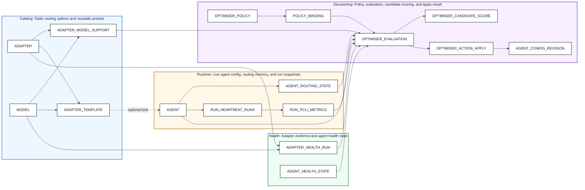
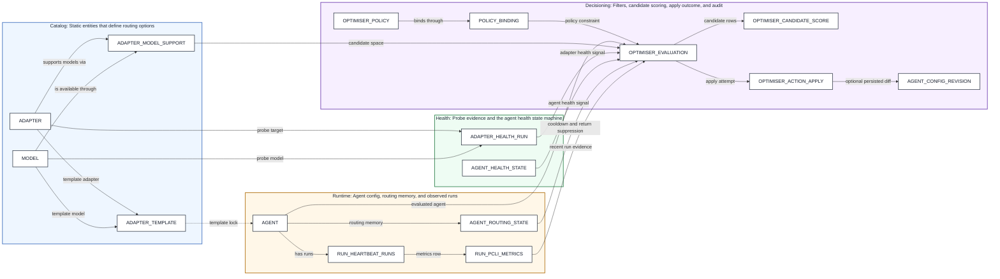

# Adapter Selection V2 — Entity Relationship Diagram

> Generated from the V2 PRD and adjusted to fit the actual pcli and Paperclip schema. Legend: `[NEW]` = new table, `[EXTEND]` = existing table with new columns, `[EXISTS]` = already present in the current system.

## Grouped Overview

### What The Groups Mean

| Group       | Purpose                                                                                                            |
| ----------- | ------------------------------------------------------------------------------------------------------------------ |
| Catalog     | Defines adapters, models, per-adapter model support, and reusable templates.                                       |
| Health      | Stores adapter probe evidence and the separate agent health state machine already present in pcli.                 |
| Runtime     | Stores the live agent config, routing hysteresis memory, and run snapshots.                                        |
| Decisioning | Stores policy constraints, evaluation intent, candidate scoring, apply results, and config revision audit records. |

## Ownership Rules

| Concern                  | Rule                                                                                                                                                                                                 |
| ------------------------ | ---------------------------------------------------------------------------------------------------------------------------------------------------------------------------------------------------- |
| Adapter availability     | `manual_override_status` is authoritative when set. Otherwise `availability_status` is a cached interpretation derived from the latest trusted health evidence.                                      |
| Health vs routing memory | `AGENT_HEALTH_STATE` owns the general health state machine. `AGENT_ROUTING_STATE` owns only routing hysteresis and short-term switch memory.                                                         |
| Evaluation vs apply      | `OPTIMISER_EVALUATION` records decision intent and rationale. `OPTIMISER_ACTION_APPLY` records the outcome of trying to apply that decision. Persisted config diffs live in `AGENT_CONFIG_REVISION`. |
| Run metrics scope        | `RUN_PCLI_METRICS` stores run evidence plus the config snapshot needed for per-config performance analysis. It does not carry optimiser switch rationale.                                            |

## Source of Truth Rules

| Concern                     | Source of truth          | Notes                                                                                                                                  |
| --------------------------- | ------------------------ | -------------------------------------------------------------------------------------------------------------------------------------- |
| Current agent config        | `AGENT`                  | In the current system this is the `agents` table, primarily `adapter_type`, `adapter_config`, and `runtime_config`.                    |
| Routing memory              | `AGENT_ROUTING_STATE`    | Owns cooldowns, settle windows, return suppression, and previous-switch memory only.                                                   |
| Health-state machine        | `AGENT_HEALTH_STATE`     | In the current system this maps to `pcli_agent_health_state`.                                                                          |
| Decision intent             | `OPTIMISER_EVALUATION`   | Owns the selected candidate, rationale, and structured evaluation payload.                                                             |
| Apply result                | `OPTIMISER_ACTION_APPLY` | Owns whether the chosen decision was actually applied, failed, or was recorded in shadow mode.                                         |
| Persisted config revision   | `AGENT_CONFIG_REVISION`  | In the current system this maps to `agent_config_revisions`, which owns the actual before/after config diff audit trail.               |
| Adapter availability status | `ADAPTER`                | `manual_override_status` wins when present; otherwise `availability_status` is the cached status derived from trusted health evidence. |

## Detailed Grouped Schema

## Entity Details

### Catalog

| Entity                | Key Fields                                                                                                                                                     |
| --------------------- | -------------------------------------------------------------------------------------------------------------------------------------------------------------- |
| ADAPTER               | `[NEW]` `name` PK, `display_label`, `priority`, `availability_status`, `health_source`, `last_health_check_at`, `last_health_run_id`, `manual_override_status` |
| MODEL                 | `[NEW]` `id` PK, `name` UK, `family`, `active`                                                                                                                 |
| ADAPTER_MODEL_SUPPORT | `[NEW]` `adapter_name` PK/FK, `model_id` PK/FK, `active`, `canonical_model_name`, `priority_within_adapter`, `supports_editing`, `supports_streaming`          |
| ADAPTER_TEMPLATE      | `[NEW]` `id` PK, `name` UK, `adapter_name` FK, `model_id` FK, `effort`, `config_json`, `active`, `created_at`                                                  |

### Health

| Entity             | Key Fields                                                                                                                                                                                                                                       |
| ------------------ | ------------------------------------------------------------------------------------------------------------------------------------------------------------------------------------------------------------------------------------------------ |
| ADAPTER_HEALTH_RUN | `[NEW]` `id` PK, `adapter_name` FK, `probe_agent_id` nullable FK, `probe_agent_name` snapshot, `model_id` FK, `started_at`, `finished_at`, `outcome`, `failure_reason`, `latency_ms`, `trusted_for_status`                                       |
| AGENT_HEALTH_STATE | `[EXISTS]` Maps to `pcli_agent_health_state`: `agent_id` PK/FK, `agent_name`, `state`, `reason_code`, `reason_detail`, `constraints`, `entered_at`, `expires_at`, `recovery_criteria`, `escalation_level`, `successful_runs_since`, `updated_at` |

### Runtime

| Entity              | Key Fields                                                                                                                                                                                                                                                                             |
| ------------------- | -------------------------------------------------------------------------------------------------------------------------------------------------------------------------------------------------------------------------------------------------------------------------------------- |
| AGENT               | `[EXISTS]` `id` PK, `company_id`, `name`, `role`, `title`, `status`, `adapter_type`, `adapter_config`, `runtime_config`, `budget_monthly_cents`, `routing_mode`, `template_id` nullable                                                                                                |
| AGENT_ROUTING_STATE | `[NEW]` `agent_id` PK/FK, `last_switch_at`, `last_switch_reason`, `previous_adapter_name`, `previous_model_id`, `return_suppressed_until`, `settle_until`, `blocked_until`, `notes_json`                                                                                               |
| RUN_HEARTBEAT_RUNS  | `[EXISTS]` `id` PK, `agent_id` FK, `status`, `started_at`, `finished_at`, `error`                                                                                                                                                                                                      |
| RUN_PCLI_METRICS    | `[EXISTS]` Maps to `pcli_run_metrics`: `run_id` PK/FK, `agent_id` FK, `agent_name`, `agent_role`, `duration_ms`, `estimated_cost_cents`, `quality_signal`, `work_type`, `config_adapter`, `config_model`, `config_effort`, `config_interval_ms`, `hit_rate_limit`, `issues_progressed` |

### Decisioning

| Entity                    | Key Fields                                                                                                                                                                                                                                                                                                                                                              |
| ------------------------- | ----------------------------------------------------------------------------------------------------------------------------------------------------------------------------------------------------------------------------------------------------------------------------------------------------------------------------------------------------------------------- |
| OPTIMISER_POLICY          | `[NEW]` `id` PK, `name`, `applies_to_scope`, `policy_type`, `config_json`, `active`                                                                                                                                                                                                                                                                                     |
| POLICY_BINDING            | `[NEW]` `id` PK, `policy_id` FK, `agent_id` nullable, `adapter_name` nullable, `template_id` nullable, `priority`                                                                                                                                                                                                                                                       |
| OPTIMISER_EVALUATION      | `[EXTEND]` Extends `pcli_optimiser_decisions`: `id` PK, `sweep_id`, `agent_id` FK, `agent_name` snapshot, `decision_type`, `action`, `before_config`, `after_config`, `reason`, `confidence`, `created_at`, `trigger_type`, `current_adapter_name`, `current_model_id`, `selected_candidate_id` nullable, `evaluation_summary_json`                                     |
| OPTIMISER_CANDIDATE_SCORE | `[NEW]` `id` PK, `evaluation_id` FK, `adapter_name` FK, `model_id` FK, `template_id` nullable, `allowed`, `excluded_reason`, `availability_score`, `health_penalty`, `recent_failure_penalty`, `rate_limit_penalty`, `cooldown_penalty`, `static_priority_score`, `total_score`, `selected`. Here `template_id` means the candidate came from a template-backed config. |
| OPTIMISER_ACTION_APPLY    | `[NEW]` `id` PK, `evaluation_id` FK, `config_revision_id` nullable FK, `applied_at`, `apply_status`, `apply_error`, `apply_summary_json`                                                                                                                                                                                                                                |
| AGENT_CONFIG_REVISION     | `[EXISTS]` Maps to `agent_config_revisions`: `id` PK, `agent_id` FK, `company_id`, `source`, `changed_keys`, `before_config`, `after_config`, `created_at`                                                                                                                                                                                                              |
